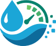
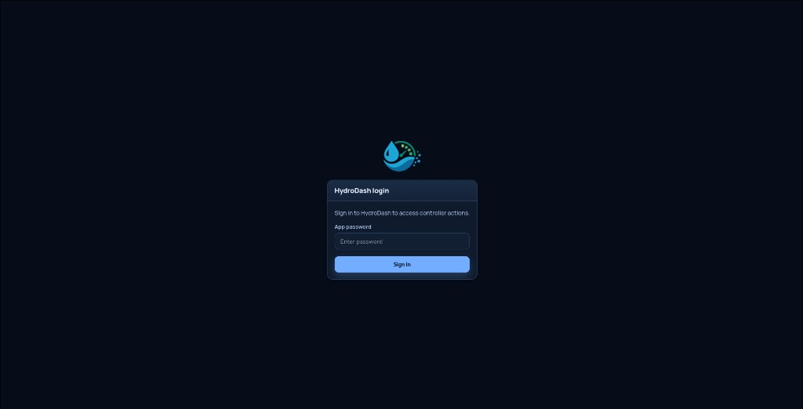
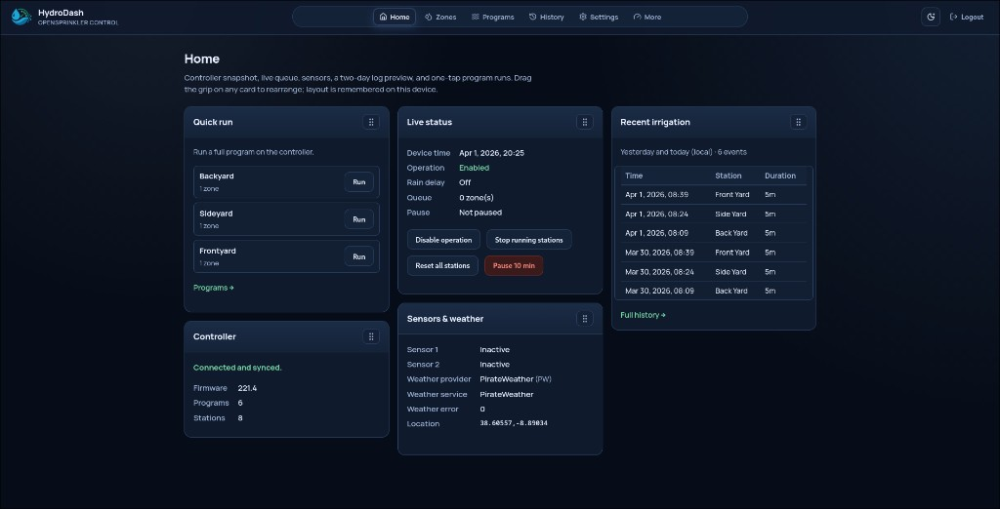
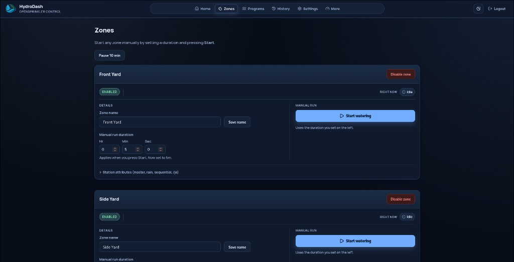
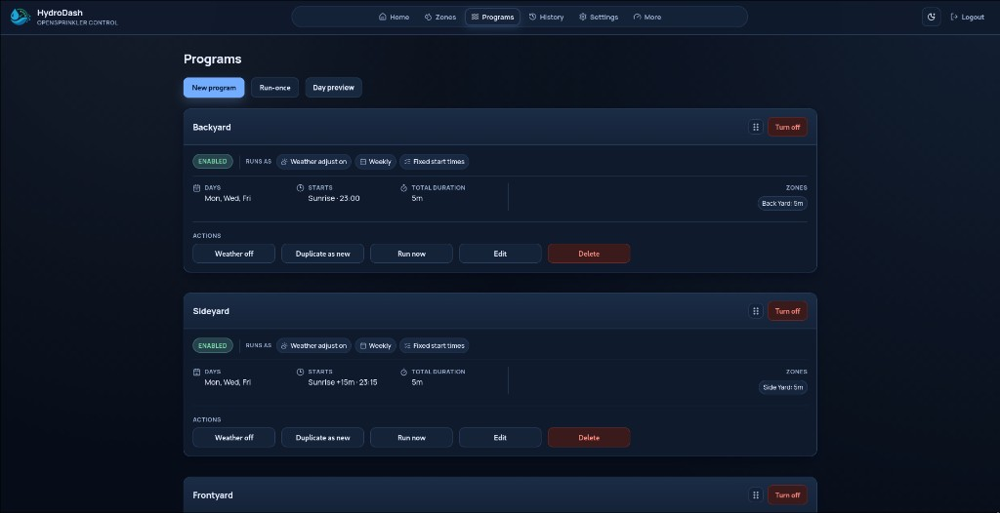
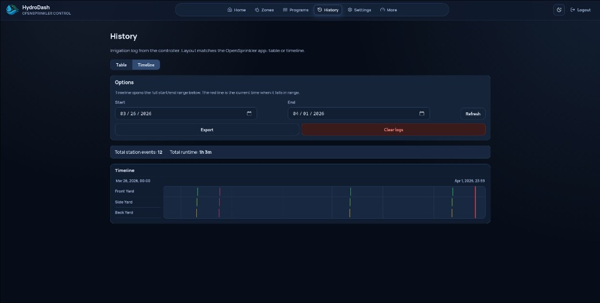
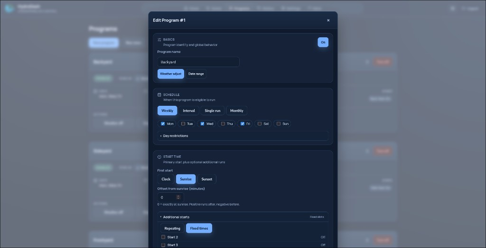

<h1 style="display:flex;align-items:center;gap:0.5rem">
  
  HydroDash
</h1>

Independent modern frontend for OpenSprinkler controllers. The npm package name in `package.json` is **hydrodash**; a default `git clone` of this repo creates a **HydroDash** directory.

**Stack:** [TanStack Start](https://tanstack.com/start) (Vite + SSR), React 19, React Query, file-based routing. OpenSprinkler API access goes through server routes under `/api/os/*`; browser login uses cookie sessions (`/api/auth/*`).

---

## Screenshots

### Login



### Home



### Zones



### Programs



### History (timeline)



### Program editor



---

## Contributing

### Dashboard widgets

To add a draggable tile on **Home**, follow **[Contributing dashboard widgets](docs/contributing-widgets.md)** (fork/branch, file checklist, data hooks, and PR expectations).

### Product roadmap (More page)

The **More** screen lists features not implemented yet. **[Roadmap requirements](docs/roadmap-requirements.md)** breaks each item into goals, gaps, API/UX notes, and draft acceptance criteria for planning and contributions.

---

## Requirements

- **Node.js** 20+ (TanStack Start / Vite 8 recommend **22.12+**)
- **npm** 10+

---

## Local development

1. Copy environment template and edit values:

   ```bash
   cp .env.example .env
   ```

2. Install dependencies and start the dev server:

   ```bash
   npm install
   npm run dev
   ```

   Default dev URL: `http://127.0.0.1:5173`

---

## Environment variables

| Variable                          | Role                                                                            |
| --------------------------------- | ------------------------------------------------------------------------------- |
| `VITE_OPENSPLINKER_BASE_URL`      | Client-side API prefix (typically `/api/os` so requests stay same-origin).      |
| `OS_BASE_URL`                     | OpenSprinkler device base URL (server-side only).                               |
| `OS_PORT`                         | Optional; merged into `OS_BASE_URL` when the URL has no port.                   |
| `OS_PASSWORD` **or** `OS_PW_HASH` | Controller authentication (never exposed to the browser).                       |
| `HYDRODASH_LOGIN_PASSWORD`        | Password for logging into HydroDash itself.                                     |
| `HYDRODASH_SESSION_SECRET`        | Secret for signing the session cookie (use a long random string in production). |

See `.env.example` for placeholders. For multi-site setups, additional server-side options may apply (see `src/server/os.ts`).

---

## Production build (Node)

TanStack Start builds **client** assets under `dist/client` and the **SSR server** under `dist/server`. Production serving in this repo uses Vite’s preview server (SSR-capable), not a static file server alone.

```bash
npm install
npm run build
npm run start
```

- `npm run start` runs `vite preview --host 0.0.0.0 --port 4173`.
- Open `http://127.0.0.1:4173` (set the same env vars as development, especially `OS_*` and `HYDRODASH_*`).

For a quick static check without SSR, `npm run preview` uses the same mechanism with default host/port.

---

## Docker

### Single container (Node only)

From this directory:

```bash
docker build -t hydrodash .
docker run --rm -p 4173:4173 --env-file .env hydrodash
```

Then open `http://127.0.0.1:4173`. Ensure `.env` exists (copy from `.env.example`).

The image runs `npm run start` inside the container. `Dockerfile` uses `npm install` in the build stage for compatibility when the lockfile and `npm ci` disagree; for reproducible CI images, keep `package-lock.json` in sync (`npm install` locally, commit) and switch the build stage to `npm ci` if you prefer.

### Docker Compose: HydroDash + nginx

[`docker-compose.yml`](docker-compose.yml) runs:

1. **`hydrodash`** — image built from [`Dockerfile`](Dockerfile), port **4173** (not published to the host; internal only).
2. **`nginx`** — Alpine nginx, publishes **8080 → 80** and reverse-proxies to `hydrodash:4173` using [`docker/nginx.conf`](docker/nginx.conf).

```bash
cp .env.example .env   # edit credentials and secrets
docker compose up --build
```

Browse **`http://127.0.0.1:8080`**. To expose port 80 on the host, change the nginx ports mapping in `docker-compose.yml` to `"80:80"`.

**TLS:** Terminate HTTPS outside this compose file (e.g. host nginx, Caddy, Traefik, or a cloud load balancer) and proxy HTTP to port 8080, or extend the nginx service with certificates and a `listen 443 ssl` server block.
